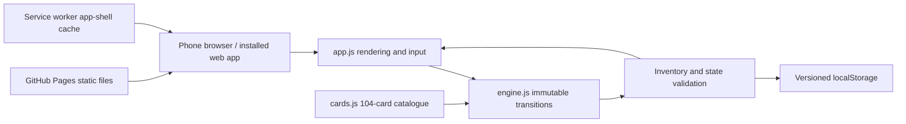
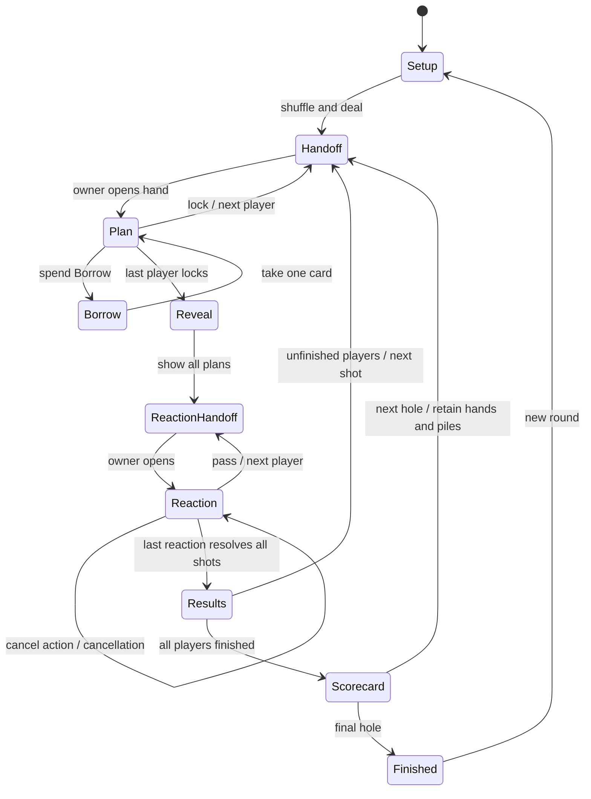
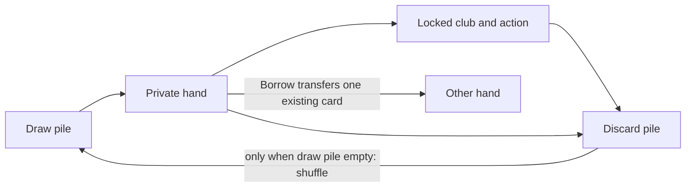
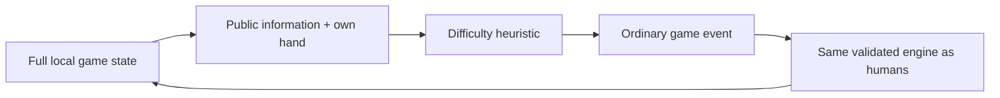

# Architecture

The browser is the complete runtime. Static hosting sends files; it does not store games or execute game logic. This avoids database bills, cloud function cold starts, polling and vendor lock-in.

## Game state machine

The implementation reuses `handoff` with `stage` set to `plan`, `borrow`, or `reaction`. Covering, browser backgrounding, and loading a private save all go through this gate. Local draft selections are not committed game state and are cleared when covered.

## Card lifecycle

Every transition clones state, validates input, mutates only the clone, then asserts unique inventory. Invalid actions throw without changing the original save. One seed initializes a deterministic PRNG; its state travels with the save. Shuffling uses Fisher–Yates. Rendering never draws or randomizes anything.

## Resolution ordering

1. Resolve cancellation chains from newest to oldest.
2. For each active player independently, collect all live actions aimed at that player.
3. Putt within range ignores actions and finishes. Otherwise add yard adjustments, clamp distance to zero, halve per trap and sum penalty strokes.
4. Move toward the hole from the pre-shot position; exact arrival finishes. Overshoot is retained as a position beyond the hole.
5. Apply the twelve-shot pickup rule when needed.
6. Move both used cards per plan to discard. Refill each hand up to eight using the finite deck.
7. Save a shared result snapshot. Record scores only when all players finish.

## Persistence and privacy

`mulligan.house.v1` holds one round. Save writes are wrapped for quota/blocked-storage failures and surface a persistent warning. Invalid JSON, invalid state and unsupported versions show a recovery notice instead of crashing. A cross-tab storage event returns to the home screen with the newest covered save.

Do not treat localStorage as encrypted or adversarially secure. DOM handoff privacy prevents casual peeking only. Names never go to a server during play. Browser data clearing, private browsing policies and device loss can remove the round.

## Performance and updates

Small event-driven DOM rendering for at most four players and roughly 32 cards in hands. O(104) cloning and invariant checks are trivial at human turn speed. No animation loop or network requests per move. Build has zero compilation/package-install requirement. Browser-native system fonts avoid remote font requests.

Cache-first service worker versions the complete shell. Increment `CACHE` in `sw.js` on releases. New workers wait until existing clients close, avoiding a forced mid-round update. Save schema changes require a separate version/migration decision. Future official deck data can replace the catalogue without redesigning the rendering boundary.

## CPU information boundary

`cpuObservation` in `src/cpu.js` copies an explicit allowlist: own hand, public positions/scores, public discard pile, turn order, and revealed plans/cancellations during reactions. It never includes shuffle seed, draw order, opponents’ hands or hidden locked plans. `chooseCpuMove` accepts only this projection and returns ordinary engine events. No CPU-only rule exceptions exist.

Easy picks a random legal shot and usually passes reactions. Normal minimizes immediate landing cost and protects its own shot. Hard adds one-shot lookahead using retained cards, estimates opponents’ likely shots and evaluates cancellation chains. Expert also excludes its own hand and public discards from the catalogue when estimating opponents’ options, and spends Mulligans on smaller worthwhile improvements. These are bounded heuristics, not guaranteed win rates or an online AI service. Preparation specials (Dig, Borrow, Read) are currently used only as club faces by CPUs; CPUs exchange an unplayable hand for the same one-stroke practice swing as humans.

CPU timers run only on their private turns, never display their hands, stop when hidden or leaving play, and resume when visible. Shared reveal, results and scorecards always wait for a human Continue action, including all-CPU spectator rounds. Work is bounded by eight cards and four targets, with cached opponent estimates per action/target; no background simulation, API or worker is needed.

The optional `controller` field is backward compatible: absent means human, preserving existing v1 saves. Current saves store one of human/easy/normal/hard/expert. The deck lifecycle changes at the next hole without discarding the current save. `course-view.js` computes a common proportional scale including positions beyond the pin and behind the tee.
